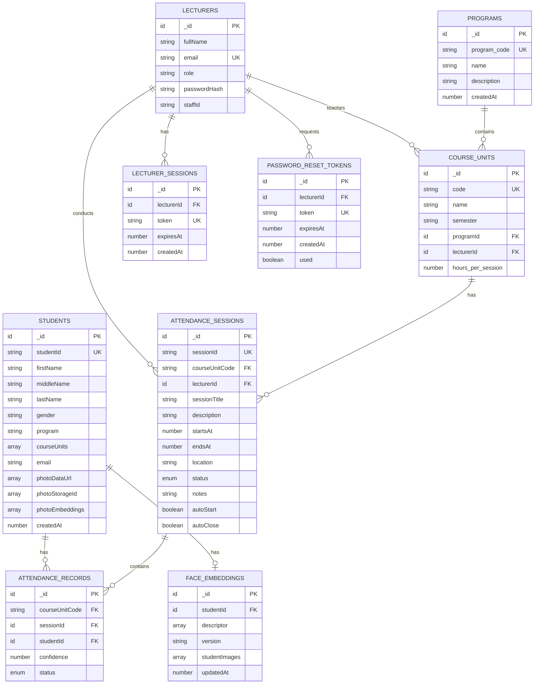
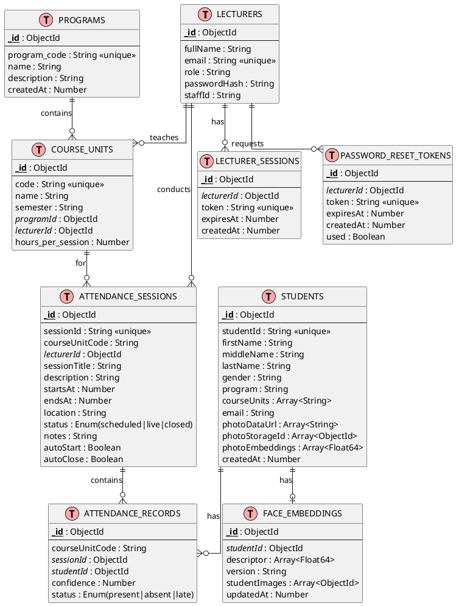
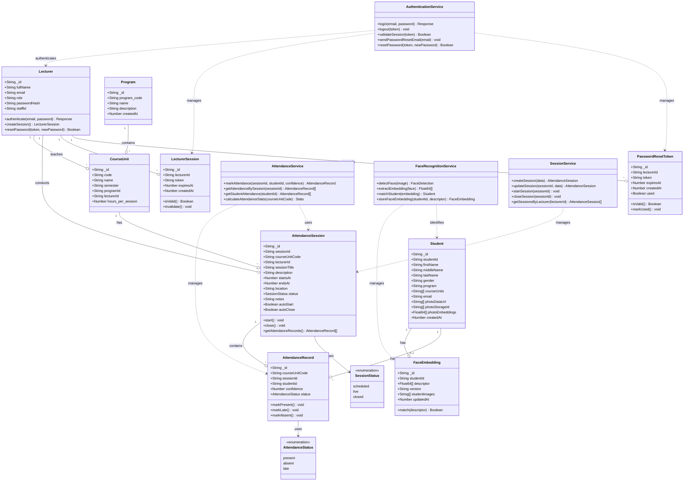
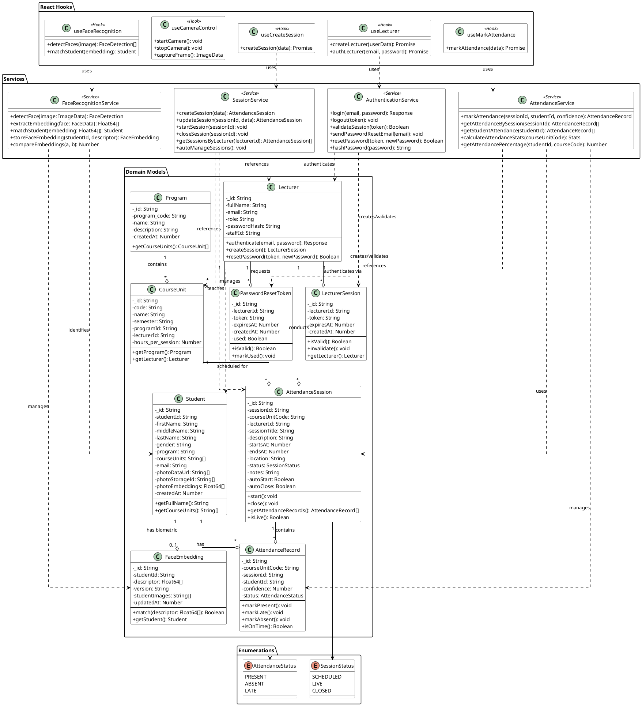

# BCATS System Diagrams

## 1. Entity Relationship Diagram (ERD)

### Mermaid ERD Syntax (for draw.io, GitHub, VS Code Preview)



### PlantUML ERD Syntax (for StarUML, PlantUML tools)



---

## 2. Class Diagram

### Mermaid Class Diagram Syntax



### PlantUML Class Diagram Syntax



---

## 3. Draw.io (diagrams.net) XML Format

### ERD for Draw.io

Copy and import this XML into draw.io:

```xml
<mxfile host="app.diagrams.net">
  <diagram name="BCATS ERD" id="bcats-erd">
    <mxGraphModel dx="1422" dy="798" grid="1" gridSize="10" guides="1" tooltips="1" connect="1" arrows="1" fold="1" page="1" pageScale="1" pageWidth="1169" pageHeight="827" math="0" shadow="0">
      <root>
        <mxCell id="0" />
        <mxCell id="1" parent="0" />
        
        <!-- LECTURERS Table -->
        <mxCell id="lecturers" value="LECTURERS" style="swimlane;fontStyle=1;align=center;verticalAlign=top;childLayout=stackLayout;horizontal=1;startSize=26;horizontalStack=0;resizeParent=1;resizeParentMax=0;resizeLast=0;collapsible=1;marginBottom=0;fillColor=#dae8fc;strokeColor=#6c8ebf;" vertex="1" parent="1">
          <mxGeometry x="40" y="40" width="180" height="156" as="geometry" />
        </mxCell>
        <mxCell id="lecturers-pk" value="PK  _id: ObjectId" style="text;strokeColor=none;fillColor=none;align=left;verticalAlign=top;spacingLeft=4;spacingRight=4;overflow=hidden;rotatable=0;points=[[0,0.5],[1,0.5]];portConstraint=eastwest;fontStyle=4;" vertex="1" parent="lecturers">
          <mxGeometry y="26" width="180" height="26" as="geometry" />
        </mxCell>
        <mxCell id="lecturers-divider" value="" style="line;strokeWidth=1;fillColor=none;align=left;verticalAlign=middle;spacingTop=-1;spacingLeft=3;spacingRight=3;rotatable=0;labelPosition=right;points=[];portConstraint=eastwest;" vertex="1" parent="lecturers">
          <mxGeometry y="52" width="180" height="8" as="geometry" />
        </mxCell>
        <mxCell id="lecturers-fields" value="fullName: String&#xa;email: String &lt;&lt;unique&gt;&gt;&#xa;role: String&#xa;passwordHash: String&#xa;staffId: String" style="text;strokeColor=none;fillColor=none;align=left;verticalAlign=top;spacingLeft=4;spacingRight=4;overflow=hidden;rotatable=0;points=[[0,0.5],[1,0.5]];portConstraint=eastwest;" vertex="1" parent="lecturers">
          <mxGeometry y="60" width="180" height="96" as="geometry" />
        </mxCell>
        
        <!-- PROGRAMS Table -->
        <mxCell id="programs" value="PROGRAMS" style="swimlane;fontStyle=1;align=center;verticalAlign=top;childLayout=stackLayout;horizontal=1;startSize=26;horizontalStack=0;resizeParent=1;resizeParentMax=0;resizeLast=0;collapsible=1;marginBottom=0;fillColor=#d5e8d4;strokeColor=#82b366;" vertex="1" parent="1">
          <mxGeometry x="280" y="40" width="180" height="130" as="geometry" />
        </mxCell>
        <mxCell id="programs-pk" value="PK  _id: ObjectId" style="text;strokeColor=none;fillColor=none;align=left;verticalAlign=top;spacingLeft=4;spacingRight=4;overflow=hidden;rotatable=0;points=[[0,0.5],[1,0.5]];portConstraint=eastwest;fontStyle=4;" vertex="1" parent="programs">
          <mxGeometry y="26" width="180" height="26" as="geometry" />
        </mxCell>
        <mxCell id="programs-divider" value="" style="line;strokeWidth=1;fillColor=none;align=left;verticalAlign=middle;spacingTop=-1;spacingLeft=3;spacingRight=3;rotatable=0;labelPosition=right;points=[];portConstraint=eastwest;" vertex="1" parent="programs">
          <mxGeometry y="52" width="180" height="8" as="geometry" />
        </mxCell>
        <mxCell id="programs-fields" value="program_code: String &lt;&lt;unique&gt;&gt;&#xa;name: String&#xa;description: String&#xa;createdAt: Number" style="text;strokeColor=none;fillColor=none;align=left;verticalAlign=top;spacingLeft=4;spacingRight=4;overflow=hidden;rotatable=0;points=[[0,0.5],[1,0.5]];portConstraint=eastwest;" vertex="1" parent="programs">
          <mxGeometry y="60" width="180" height="70" as="geometry" />
        </mxCell>
        
        <!-- COURSE_UNITS Table -->
        <mxCell id="course_units" value="COURSE_UNITS" style="swimlane;fontStyle=1;align=center;verticalAlign=top;childLayout=stackLayout;horizontal=1;startSize=26;horizontalStack=0;resizeParent=1;resizeParentMax=0;resizeLast=0;collapsible=1;marginBottom=0;fillColor=#fff2cc;strokeColor=#d6b656;" vertex="1" parent="1">
          <mxGeometry x="160" y="220" width="200" height="170" as="geometry" />
        </mxCell>
        <mxCell id="course_units-pk" value="PK  _id: ObjectId" style="text;strokeColor=none;fillColor=none;align=left;verticalAlign=top;spacingLeft=4;spacingRight=4;overflow=hidden;rotatable=0;points=[[0,0.5],[1,0.5]];portConstraint=eastwest;fontStyle=4;" vertex="1" parent="course_units">
          <mxGeometry y="26" width="200" height="26" as="geometry" />
        </mxCell>
        <mxCell id="course_units-divider" value="" style="line;strokeWidth=1;fillColor=none;align=left;verticalAlign=middle;spacingTop=-1;spacingLeft=3;spacingRight=3;rotatable=0;labelPosition=right;points=[];portConstraint=eastwest;" vertex="1" parent="course_units">
          <mxGeometry y="52" width="200" height="8" as="geometry" />
        </mxCell>
        <mxCell id="course_units-fields" value="code: String &lt;&lt;unique&gt;&gt;&#xa;name: String&#xa;semester: String&#xa;FK  programId: ObjectId&#xa;FK  lecturerId: ObjectId&#xa;hours_per_session: Number" style="text;strokeColor=none;fillColor=none;align=left;verticalAlign=top;spacingLeft=4;spacingRight=4;overflow=hidden;rotatable=0;points=[[0,0.5],[1,0.5]];portConstraint=eastwest;" vertex="1" parent="course_units">
          <mxGeometry y="60" width="200" height="110" as="geometry" />
        </mxCell>
        
        <!-- STUDENTS Table -->
        <mxCell id="students" value="STUDENTS" style="swimlane;fontStyle=1;align=center;verticalAlign=top;childLayout=stackLayout;horizontal=1;startSize=26;horizontalStack=0;resizeParent=1;resizeParentMax=0;resizeLast=0;collapsible=1;marginBottom=0;fillColor=#e1d5e7;strokeColor=#9673a6;" vertex="1" parent="1">
          <mxGeometry x="520" y="40" width="200" height="260" as="geometry" />
        </mxCell>
        <mxCell id="students-pk" value="PK  _id: ObjectId" style="text;strokeColor=none;fillColor=none;align=left;verticalAlign=top;spacingLeft=4;spacingRight=4;overflow=hidden;rotatable=0;points=[[0,0.5],[1,0.5]];portConstraint=eastwest;fontStyle=4;" vertex="1" parent="students">
          <mxGeometry y="26" width="200" height="26" as="geometry" />
        </mxCell>
        <mxCell id="students-divider" value="" style="line;strokeWidth=1;fillColor=none;align=left;verticalAlign=middle;spacingTop=-1;spacingLeft=3;spacingRight=3;rotatable=0;labelPosition=right;points=[];portConstraint=eastwest;" vertex="1" parent="students">
          <mxGeometry y="52" width="200" height="8" as="geometry" />
        </mxCell>
        <mxCell id="students-fields" value="studentId: String &lt;&lt;unique&gt;&gt;&#xa;firstName: String&#xa;middleName: String&#xa;lastName: String&#xa;gender: String&#xa;program: String&#xa;courseUnits: Array&lt;String&gt;&#xa;email: String&#xa;photoDataUrl: Array&lt;String&gt;&#xa;photoStorageId: Array&lt;ObjectId&gt;&#xa;photoEmbeddings: Array&lt;Float64&gt;&#xa;createdAt: Number" style="text;strokeColor=none;fillColor=none;align=left;verticalAlign=top;spacingLeft=4;spacingRight=4;overflow=hidden;rotatable=0;points=[[0,0.5],[1,0.5]];portConstraint=eastwest;" vertex="1" parent="students">
          <mxGeometry y="60" width="200" height="200" as="geometry" />
        </mxCell>
        
        <!-- FACE_EMBEDDINGS Table -->
        <mxCell id="face_embeddings" value="FACE_EMBEDDINGS" style="swimlane;fontStyle=1;align=center;verticalAlign=top;childLayout=stackLayout;horizontal=1;startSize=26;horizontalStack=0;resizeParent=1;resizeParentMax=0;resizeLast=0;collapsible=1;marginBottom=0;fillColor=#f8cecc;strokeColor=#b85450;" vertex="1" parent="1">
          <mxGeometry x="780" y="40" width="200" height="156" as="geometry" />
        </mxCell>
        <mxCell id="face_embeddings-pk" value="PK  _id: ObjectId" style="text;strokeColor=none;fillColor=none;align=left;verticalAlign=top;spacingLeft=4;spacingRight=4;overflow=hidden;rotatable=0;points=[[0,0.5],[1,0.5]];portConstraint=eastwest;fontStyle=4;" vertex="1" parent="face_embeddings">
          <mxGeometry y="26" width="200" height="26" as="geometry" />
        </mxCell>
        <mxCell id="face_embeddings-divider" value="" style="line;strokeWidth=1;fillColor=none;align=left;verticalAlign=middle;spacingTop=-1;spacingLeft=3;spacingRight=3;rotatable=0;labelPosition=right;points=[];portConstraint=eastwest;" vertex="1" parent="face_embeddings">
          <mxGeometry y="52" width="200" height="8" as="geometry" />
        </mxCell>
        <mxCell id="face_embeddings-fields" value="FK  studentId: ObjectId&#xa;descriptor: Array&lt;Float64&gt;&#xa;version: String&#xa;studentImages: Array&lt;ObjectId&gt;&#xa;updatedAt: Number" style="text;strokeColor=none;fillColor=none;align=left;verticalAlign=top;spacingLeft=4;spacingRight=4;overflow=hidden;rotatable=0;points=[[0,0.5],[1,0.5]];portConstraint=eastwest;" vertex="1" parent="face_embeddings">
          <mxGeometry y="60" width="200" height="96" as="geometry" />
        </mxCell>
        
        <!-- ATTENDANCE_SESSIONS Table -->
        <mxCell id="attendance_sessions" value="ATTENDANCE_SESSIONS" style="swimlane;fontStyle=1;align=center;verticalAlign=top;childLayout=stackLayout;horizontal=1;startSize=26;horizontalStack=0;resizeParent=1;resizeParentMax=0;resizeLast=0;collapsible=1;marginBottom=0;fillColor=#ffe6cc;strokeColor=#d79b00;" vertex="1" parent="1">
          <mxGeometry x="420" y="340" width="220" height="280" as="geometry" />
        </mxCell>
        <mxCell id="attendance_sessions-pk" value="PK  _id: ObjectId" style="text;strokeColor=none;fillColor=none;align=left;verticalAlign=top;spacingLeft=4;spacingRight=4;overflow=hidden;rotatable=0;points=[[0,0.5],[1,0.5]];portConstraint=eastwest;fontStyle=4;" vertex="1" parent="attendance_sessions">
          <mxGeometry y="26" width="220" height="26" as="geometry" />
        </mxCell>
        <mxCell id="attendance_sessions-divider" value="" style="line;strokeWidth=1;fillColor=none;align=left;verticalAlign=middle;spacingTop=-1;spacingLeft=3;spacingRight=3;rotatable=0;labelPosition=right;points=[];portConstraint=eastwest;" vertex="1" parent="attendance_sessions">
          <mxGeometry y="52" width="220" height="8" as="geometry" />
        </mxCell>
        <mxCell id="attendance_sessions-fields" value="sessionId: String &lt;&lt;unique&gt;&gt;&#xa;courseUnitCode: String&#xa;FK  lecturerId: ObjectId&#xa;sessionTitle: String&#xa;description: String&#xa;startsAt: Number&#xa;endsAt: Number&#xa;location: String&#xa;status: Enum(scheduled|live|closed)&#xa;notes: String&#xa;autoStart: Boolean&#xa;autoClose: Boolean" style="text;strokeColor=none;fillColor=none;align=left;verticalAlign=top;spacingLeft=4;spacingRight=4;overflow=hidden;rotatable=0;points=[[0,0.5],[1,0.5]];portConstraint=eastwest;" vertex="1" parent="attendance_sessions">
          <mxGeometry y="60" width="220" height="220" as="geometry" />
        </mxCell>
        
        <!-- ATTENDANCE_RECORDS Table -->
        <mxCell id="attendance_records" value="ATTENDANCE_RECORDS" style="swimlane;fontStyle=1;align=center;verticalAlign=top;childLayout=stackLayout;horizontal=1;startSize=26;horizontalStack=0;resizeParent=1;resizeParentMax=0;resizeLast=0;collapsible=1;marginBottom=0;fillColor=#f5f5f5;strokeColor=#666666;fontColor=#333333;" vertex="1" parent="1">
          <mxGeometry x="700" y="340" width="220" height="170" as="geometry" />
        </mxCell>
        <mxCell id="attendance_records-pk" value="PK  _id: ObjectId" style="text;strokeColor=none;fillColor=none;align=left;verticalAlign=top;spacingLeft=4;spacingRight=4;overflow=hidden;rotatable=0;points=[[0,0.5],[1,0.5]];portConstraint=eastwest;fontStyle=4;" vertex="1" parent="attendance_records">
          <mxGeometry y="26" width="220" height="26" as="geometry" />
        </mxCell>
        <mxCell id="attendance_records-divider" value="" style="line;strokeWidth=1;fillColor=none;align=left;verticalAlign=middle;spacingTop=-1;spacingLeft=3;spacingRight=3;rotatable=0;labelPosition=right;points=[];portConstraint=eastwest;" vertex="1" parent="attendance_records">
          <mxGeometry y="52" width="220" height="8" as="geometry" />
        </mxCell>
        <mxCell id="attendance_records-fields" value="courseUnitCode: String&#xa;FK  sessionId: ObjectId&#xa;FK  studentId: ObjectId&#xa;confidence: Number&#xa;status: Enum(present|absent|late)" style="text;strokeColor=none;fillColor=none;align=left;verticalAlign=top;spacingLeft=4;spacingRight=4;overflow=hidden;rotatable=0;points=[[0,0.5],[1,0.5]];portConstraint=eastwest;" vertex="1" parent="attendance_records">
          <mxGeometry y="60" width="220" height="110" as="geometry" />
        </mxCell>
        
        <!-- LECTURER_SESSIONS Table -->
        <mxCell id="lecturer_sessions" value="LECTURER_SESSIONS" style="swimlane;fontStyle=1;align=center;verticalAlign=top;childLayout=stackLayout;horizontal=1;startSize=26;horizontalStack=0;resizeParent=1;resizeParentMax=0;resizeLast=0;collapsible=1;marginBottom=0;fillColor=#dae8fc;strokeColor=#6c8ebf;" vertex="1" parent="1">
          <mxGeometry x="40" y="240" width="180" height="130" as="geometry" />
        </mxCell>
        <mxCell id="lecturer_sessions-pk" value="PK  _id: ObjectId" style="text;strokeColor=none;fillColor=none;align=left;verticalAlign=top;spacingLeft=4;spacingRight=4;overflow=hidden;rotatable=0;points=[[0,0.5],[1,0.5]];portConstraint=eastwest;fontStyle=4;" vertex="1" parent="lecturer_sessions">
          <mxGeometry y="26" width="180" height="26" as="geometry" />
        </mxCell>
        <mxCell id="lecturer_sessions-divider" value="" style="line;strokeWidth=1;fillColor=none;align=left;verticalAlign=middle;spacingTop=-1;spacingLeft=3;spacingRight=3;rotatable=0;labelPosition=right;points=[];portConstraint=eastwest;" vertex="1" parent="lecturer_sessions">
          <mxGeometry y="52" width="180" height="8" as="geometry" />
        </mxCell>
        <mxCell id="lecturer_sessions-fields" value="FK  lecturerId: ObjectId&#xa;token: String &lt;&lt;unique&gt;&gt;&#xa;expiresAt: Number&#xa;createdAt: Number" style="text;strokeColor=none;fillColor=none;align=left;verticalAlign=top;spacingLeft=4;spacingRight=4;overflow=hidden;rotatable=0;points=[[0,0.5],[1,0.5]];portConstraint=eastwest;" vertex="1" parent="lecturer_sessions">
          <mxGeometry y="60" width="180" height="70" as="geometry" />
        </mxCell>
        
        <!-- PASSWORD_RESET_TOKENS Table -->
        <mxCell id="password_reset_tokens" value="PASSWORD_RESET_TOKENS" style="swimlane;fontStyle=1;align=center;verticalAlign=top;childLayout=stackLayout;horizontal=1;startSize=26;horizontalStack=0;resizeParent=1;resizeParentMax=0;resizeLast=0;collapsible=1;marginBottom=0;fillColor=#dae8fc;strokeColor=#6c8ebf;" vertex="1" parent="1">
          <mxGeometry x="40" y="400" width="200" height="156" as="geometry" />
        </mxCell>
        <mxCell id="password_reset_tokens-pk" value="PK  _id: ObjectId" style="text;strokeColor=none;fillColor=none;align=left;verticalAlign=top;spacingLeft=4;spacingRight=4;overflow=hidden;rotatable=0;points=[[0,0.5],[1,0.5]];portConstraint=eastwest;fontStyle=4;" vertex="1" parent="password_reset_tokens">
          <mxGeometry y="26" width="200" height="26" as="geometry" />
        </mxCell>
        <mxCell id="password_reset_tokens-divider" value="" style="line;strokeWidth=1;fillColor=none;align=left;verticalAlign=middle;spacingTop=-1;spacingLeft=3;spacingRight=3;rotatable=0;labelPosition=right;points=[];portConstraint=eastwest;" vertex="1" parent="password_reset_tokens">
          <mxGeometry y="52" width="200" height="8" as="geometry" />
        </mxCell>
        <mxCell id="password_reset_tokens-fields" value="FK  lecturerId: ObjectId&#xa;token: String &lt;&lt;unique&gt;&gt;&#xa;expiresAt: Number&#xa;createdAt: Number&#xa;used: Boolean" style="text;strokeColor=none;fillColor=none;align=left;verticalAlign=top;spacingLeft=4;spacingRight=4;overflow=hidden;rotatable=0;points=[[0,0.5],[1,0.5]];portConstraint=eastwest;" vertex="1" parent="password_reset_tokens">
          <mxGeometry y="60" width="200" height="96" as="geometry" />
        </mxCell>
        
      </root>
    </mxGraphModel>
  </diagram>
</mxfile>
```

---

## 4. Quick Reference - Relationships Summary

| Parent Entity | Relationship | Child Entity | Cardinality |
|--------------|--------------|--------------|-------------|
| Lecturers | teaches | Course_Units | 1:N |
| Lecturers | conducts | Attendance_Sessions | 1:N |
| Lecturers | has | Lecturer_Sessions | 1:N |
| Lecturers | requests | Password_Reset_Tokens | 1:N |
| Programs | contains | Course_Units | 1:N |
| Students | has | Face_Embeddings | 1:1 |
| Students | has | Attendance_Records | 1:N |
| Attendance_Sessions | contains | Attendance_Records | 1:N |
| Course_Units | has | Attendance_Sessions | 1:N |

---

## 5. How to Use These Diagrams

### Mermaid Diagrams
1. **VS Code**: Install "Mermaid Preview" extension, then view the .md file
2. **GitHub**: Directly renders Mermaid in README files
3. **draw.io**: File → Import → Paste the Mermaid code
4. **Online**: Use https://mermaid.live to render and export

### PlantUML Diagrams
1. **VS Code**: Install "PlantUML" extension
2. **Online**: Use https://www.plantuml.com/plantuml
3. **IntelliJ/StarUML**: Built-in PlantUML support
4. **Export**: Can export to PNG, SVG, PDF

### Draw.io XML
1. Open https://app.diagrams.net
2. File → Import From → Device
3. Save the XML content as a .drawio file and import
4. Or File → Import → Paste the XML directly

